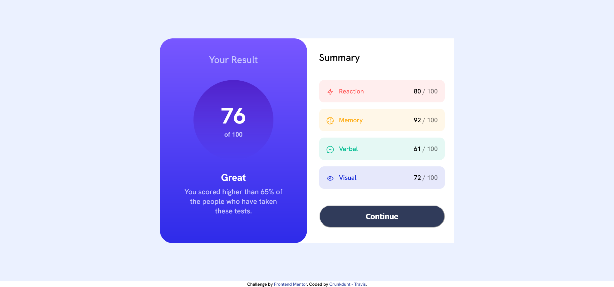

# Frontend Mentor - Results summary component solution

This is a solution to the [Results summary component challenge on Frontend Mentor](https://www.frontendmentor.io/challenges/results-summary-component-CE_K6s0maV). Frontend Mentor challenges help you improve your coding skills by building realistic projects. 

## Table of contents

- [Frontend Mentor - Results summary component solution](#frontend-mentor---results-summary-component-solution)
  - [Table of contents](#table-of-contents)
  - [Overview](#overview)
    - [The challenge](#the-challenge)
    - [Screenshot](#screenshot)
    - [Links](#links)
  - [My process](#my-process)
    - [Built with](#built-with)
    - [What I learned](#what-i-learned)
    - [Continued development](#continued-development)
  - [Acknowledgments](#acknowledgments)

**Note: Delete this note and update the table of contents based on what sections you keep.**

## Overview

### The challenge

Users should be able to:

- View the optimal layout for the interface depending on their device's screen size
- See hover and focus states for all interactive elements on the page

### Screenshot

### Links

- Solution URL: [Add solution URL here](https://github.com/Crunkdunt/frontend_mentor/tree/main/results-summary-component-main)
- Live Site URL: [Add live site URL here](https://crunkdunt.github.io/frontend_mentor/results-summary-component-main/index.html)

## My process

I started this design by making note of the variables within the Figma file. After setting variables for the fonts, colours etc, I started to layout the html. 
The html itself is not semantic, i opted for simplicity for the sake of practice. 
I will revisit this again in the future to update and refactor.

SCSS was used for the CSS, this allowed me to create mixins for the font and breakpoints, among other things.   

### Built with

- HTML5 markup
- SASS/SCSS
- Flexbox
- Mobile-first workflow
- BEM - a first attempt. Not 100% but good practice

**Note: These are just examples. Delete this note and replace the list above with your own choices**

### What I learned

Doing this allowed me to gain a firmer grasp and appreciation of the simplicity of flex for layouts and sturcture. I am happy with how close to the design brief my solution is. I also learned that it is easy to fall into a padding and margin hellscape, so its best to try to avoid.

This project has also greatly helped my appreciation of SCSS and BEM.

### Continued development

I am looking forward to working through more of the frontend mentor challenges.

## Acknowledgments

I hope that you have enjoyed looking through this as I enjoyed doing it. Im excited to continue on this journey and am looking forward to checing out some other solutions.

**Note: Delete this note and edit this section's content as necessary. If you completed this challenge by yourself, feel free to delete this section entirely.**
